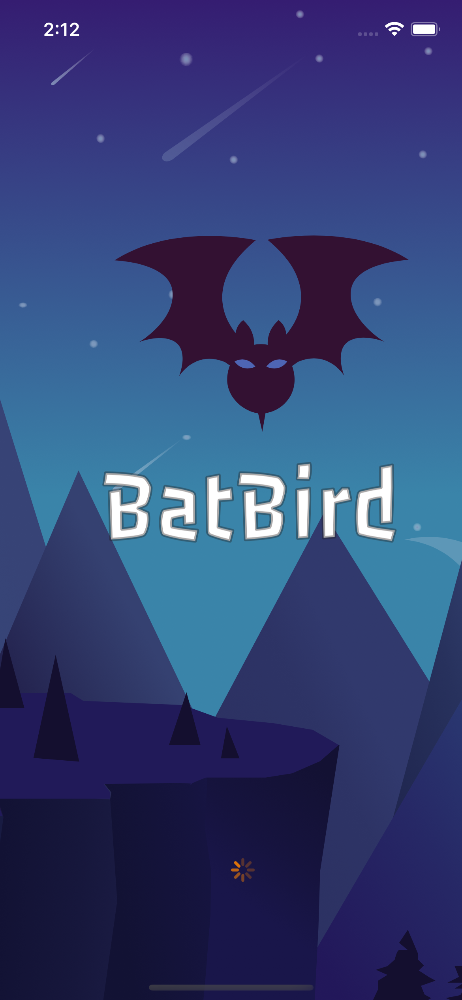
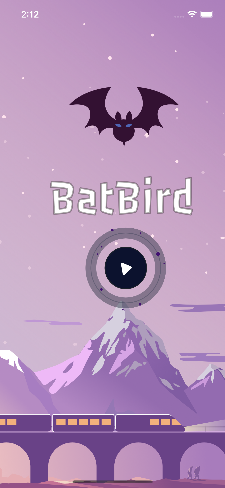

<h1 align="center">
  
</h1>

<h3 align="center">
  BatBird
</h3>

<p align="center">BatBird - Jogo Desenvolvido em React Native</p>

<p align="center">
  <a href="#%EF%B8%8F-about-the-project">Sobre o projeto</a>&nbsp;&nbsp;&nbsp;|&nbsp;&nbsp;&nbsp;
  <a href="#-technologies">Técnologias</a>&nbsp;&nbsp;&nbsp;|&nbsp;&nbsp;&nbsp;
  <a href="#-getting-started">Introdução>&nbsp;&nbsp;&nbsp;|&nbsp;&nbsp;&nbsp;
  <a href="#-how-to-contribute">Como contribuir </a>&nbsp;&nbsp;&nbsp;|&nbsp;&nbsp;&nbsp;
  <a href="#-license">Licença</a>
</p>

## 💇🏻‍♂️ Sobre o projeto

Bem-vindo ao BatBird, um emocionante jogo desenvolvido em React Native que combina a magia do desenvolvimento móvel com a potência das bibliotecas react-native-game-engine e matter-js. Embarque em uma jornada épica com nosso protagonista, o corajoso BatBird, e explore um mundo cheio de desafios, obstáculos e diversão.

<h1 align="center">
  
</h1>

## 🚀 Tecnologias

Tecnologias que usei para desenvolver este cliente móvel

- [ReactJS](https://reactjs.org/)
- [TypeScript](https://www.typescriptlang.org/)
- [React Native](https://reactnative.dev/)
- [React Navigation](https://reactnavigation.org/)
- [React Native Vector Icons](https://github.com/oblador/react-native-vector-icons)
- [Styled Components](https://styled-components.com/)
- [Axios](https://github.com/axios/axios)
- [React Native Reanimated](https://docs.swmansion.com/react-native-reanimated)
- [Gesture Handler](https://docs.swmansion.com/react-native-gesture-handler/docs/)
- [Matter-js](https://brm.io/matter-js)
- [React Native Game Engine](https://github.com/bberak/react-native-game-engine)

### Requirements

Ambiente configurado para emular aplicativos.

**Clone o projeto e acesse a pasta**

```bash
$ https://github.com/CristianoVieira1/batBird && cd batBird
```

**Siga os passos abaixo**

```bash
# Install the dependencies
$ yarn

# If you are going to emulate with android, run this command
# Be sure to have the emulator open
$ yarn android

# If you are going to emulate with ios, run this command
$ yarn ios
```

## 🤔 como contribuir

**Faça uma bifurcação deste repositório**

```bash
# Fork using GitHub official command line
# If you don't have the GitHub CLI, use the web site to do that.

$ gh repo fork CristianoVieira1/batBird
```

**Siga os passos abaixo**

```bash
# Clone your fork
$ git clone your-fork-url && cd batBird

# Create a branch with your feature
$ git checkout -b my-feature

# Make the commit with your changes
$ git commit -m 'feat: My new feature'

# Send the code to your remote branch
$ git push origin my-feature
```

Depois que sua solicitação pull for mesclada, você poderá excluir sua ramificação

## 📝 License

Este projeto está licenciado sob a licença MIT - consulte o arquivo [LICENSE](LICENSE) para obter detalhes.

---

Feito com 💜 por Cristiano Borges 👋 [linkedin](https://www.linkedin.com/in/cristianobv/)

Conheça meu Portfólio 🚀 [portfolio](https://cristianovieira1.github.io/portfolio/)
